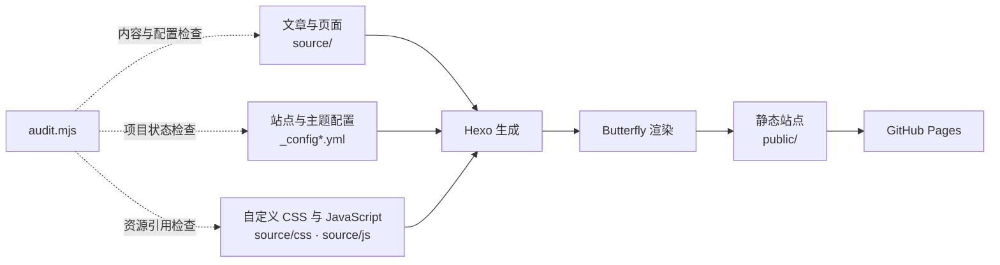

<div align="center">

# 𝓢𝓲𝓼𝔂𝓹𝓱𝓾𝓼 𝓥𝓪𝓵𝓮'𝓼 𝓦𝓸𝓻𝓴𝓢𝓹𝓪𝓬𝓮


<p align="center">基于 𝑯𝒆𝒙𝒐 与 𝑩𝒖𝒕𝒕𝒆𝒓𝒇𝒍𝒚 的中文知识博客与可验证维护工作流</p>

[](https://hexo.io/)
[](https://github.com/jerryc127/hexo-theme-butterfly)
[](https://nodejs.org/)

<p><a href="https://koco-co.github.io/">访问在线博客</a></p>

</div>

<a id="overview"></a>

<h2 align="center">𝑶𝒗𝒆𝒓𝒗𝒊𝒆𝒘 · 项目简介</h2>

<p>这是一个使用 <b>Hexo</b> 与 <b>Butterfly</b> 构建的中文个人知识博客。仓库集中维护文章、专题页面、站点配置、自定义样式与脚本，并通过项目审计工具和三个项目级 <b>Agent Skill</b> 约束日常维护、系统课程与显式部署。</p>

- 使用 <b>Markdown</b> 管理文章，通过 `hexo-abbrlink` 生成稳定的 `posts/:abbrlink/` 永久链接。
- 提供本地搜索、文章加密、评论、暗色模式、阅读模式、繁简转换、懒加载和字数统计。
- 支持 <b>Butterfly</b> 内置标签及 <b>Tag Plugins Plus</b> 外挂标签，并对插件注册、配置和容器闭合执行机械审计。
- 图片资源随博客源码本地维护，文章与照片墙直接引用 `source/img/picgo-images/`，不依赖独立图床仓库提供线上图片。
- 通过自定义 `CSS`、`JavaScript` 和专题页面扩展宇宙背景、日期提示、标签视觉、热力图、音乐、视频、友链与照片墙等体验。
- 使用独立的维护、系统课程与部署 <b>Skill</b>，避免把普通内容修改自动扩张为清理、提交或发布。

<a id="features"></a>

<h2 align="center">𝑭𝒆𝒂𝒕𝒖𝒓𝒆𝒔 · 核心能力</h2>

| 能力 | 当前实现 | 主要入口 |
| --- | --- | --- |
| 内容与永久链接 | Markdown、Front Matter、`hexo-abbrlink` | `source/_posts/`、`_config.yml` |
| 页面与主题体验 | Butterfly、搜索、评论、PJAX、懒加载、暗色与阅读模式 | `_config.butterfly.yml` |
| 标签外挂 | Butterfly 内置标签与 Tag Plugins Plus | 文章源码、主题标签实现、已安装插件 |
| 自定义前端 | 专题 CSS、JavaScript 与 PJAX 生命周期 | `source/css/`、`source/js/` |
| 本地图片 | 本地优先、迁移哈希清单、旧图床引用审计 | `source/img/picgo-images/`、`image-migration-map.json` |
| 内容安全 | 文章加密、敏感配置边界、发布前审计 | Front Matter、配置、`audit.mjs` |
| Agent 维护 | 日常维护与显式部署分离 | `.agents/skills/`、`AGENTS.md` |

<a id="architecture"></a>

<h2 align="center">𝑨𝒓𝒄𝒉𝒊𝒕𝒆𝒄𝒕𝒖𝒓𝒆 · 构建链路</h2>



<p>`source/` 和根配置是维护入口；`public/`、`db.json`、日志及 `.deploy_git/` 属于生成或发布状态，不作为手工编辑源。</p>

<a id="quick-start"></a>

<h2 align="center">𝑸𝒖𝒊𝒄𝒌 𝑺𝒕𝒂𝒓𝒕 · 快速开始</h2>

<p>准备 <b>Node.js</b> 20.19.0 或更高版本以及 <b>npm</b>，在项目根目录安装依赖并启动本地服务：</p>

```bash
npm install
npm run server
```

<p>默认访问地址为 `http://localhost:4000`。依赖版本由 `package-lock.json` 锁定；不要使用低于当前 <b>Hexo</b> 要求的运行时。</p>

<a id="commands"></a>

<h2 align="center">𝑪𝒐𝒎𝒎𝒂𝒏𝒅𝒔 · 常用命令</h2>

| 命令 | 用途 | 影响或边界 |
| --- | --- | --- |
| `npm run server` | 启动本地预览服务 | 默认端口 4000 |
| `npm run build` | 生成静态站点 | 写入 `public/`、`db.json`，插件可能写回 `abbrlink` |
| `npm run clean` | 清理缓存和生成物 | 会删除生成内容，执行前单独确认 |
| `./node_modules/.bin/hexo new "标题"` | 创建文章 | 创建后仍需补全项目要求的 Front Matter |
| `node .agents/scripts/audit.mjs lint --json` | 运行全仓库 Hexo lint | 聚合项目、目录、配置、代码、Skill、文档、内容、标签和资源检查；仅 `status: pass` 可验收 |
| `node .agents/scripts/audit.mjs config --json` | 检查配置、依赖与锁文件 | JSON/YAML、npm scripts、依赖安装和 lock 漂移会给出具体路径 |
| `node .agents/scripts/audit.mjs code --json` | 检查维护源码语法 | 覆盖 JavaScript、CSS 和 Shell |
| `node .agents/scripts/audit.mjs skills --json` | 检查 Agent Skill 接入 | 覆盖 Front Matter、资源引用、目录命名和 Claude 相对软链接 |
| `node .agents/scripts/audit.mjs docs --json` | 检查仓库文档 | 阻断无法解析的本地 Markdown 链接与未闭合围栏 |
| `node .agents/scripts/audit.mjs project --json` | 检查项目、配置、运行时和 Git 边界 | 输出脱敏项目事实 |
| `node .agents/scripts/audit.mjs content --json` | 检查文章字段、结构、课程契约、参考资料卡片、预览图域名与链接状态 | 公开课程必须有 `linkgroup/link`、有效 HTTP(S) 资料链接和合适预览图；构建前允许缺少 `abbrlink` |
| `node .agents/scripts/audit.mjs tags --json` | 检查真实标签注册、配置和容器闭合 | 未注册标签与禁用能力会阻断 |
| `node .agents/scripts/audit.mjs assets --json` | 检查本地图片、迁移哈希与旧图床引用 | 教程代码示例与真实渲染引用分开统计 |
| `node --test .agents/scripts/audit.test.mjs` | 验证审计工具契约 | 包含聚合 lint 与当前工作区全绿测试 |
| `npm run deploy` | 执行本地部署 | 仅在显式部署授权和发布预检通过后运行 |

<a id="content"></a>

<h2 align="center">𝑪𝒐𝒏𝒕𝒆𝒏𝒕 · 内容维护</h2>

<p>文章位于 `source/_posts/`。每篇文章至少包含以下 <b>Front Matter</b>：</p>

```yaml
---
title: 文章标题
tags:
  - 标签
categories:
  - 分类
description: 文章摘要
date: YYYY-MM-DD HH:mm:ss
---
```

- `abbrlink` 可在首次构建前缺省，由当前插件生成；发布检查要求它存在且全站唯一。
- 编辑已有文章时保留 `cover`、`updated`、`sticky`、`password` 等与任务无关的可选字段，并禁止展示密码值。
- 新增正文图片直接存放在 `source/img/picgo-images/`，正文使用 `/img/picgo-images/<name>` 引用，不再通过 <b>PicGo</b> 上传到远程图床。
- 旧图床迁移清单位于 `tools/hexo-blog/image-migration-map.json`，记录固定来源提交、源路径、目标路径、字节数与 <b>SHA-256</b>；教程代码中的旧地址可作为示例保留，真实渲染内容不得继续使用。
- 使用标签外挂前先运行 `tags` 审计，并以当前主题、插件源码和项目参考为准；容器标签必须按栈顺序闭合。
- 新文章优先遵循 [维护 Skill 文章模板](.agents/skills/hexo-blog-maintenance/templates/post.template.md)，因为当前 `scaffolds/post.md` 尚未包含全部必需字段。

<a id="structure"></a>

<h2 align="center">𝑺𝒕𝒓𝒖𝒄𝒕𝒖𝒓𝒆 · 项目结构</h2>

| 路径 | 职责 |
| --- | --- |
| `source/_posts/` | 文章源文件 |
| `source/*/index.md` | 关于、标签、分类、音乐、视频、友链和其他独立页面 |
| `source/_data/` | 友链等结构化数据 |
| `source/img/picgo-images/` | 文章、封面与照片墙使用的本地图片资源 |
| `source/css/`、`source/js/` | 主题覆盖样式和自定义前端功能 |
| `_config.yml` | Hexo 主配置、站点地址、永久链接和部署目标 |
| `_config.butterfly.yml` | Butterfly 功能、主题外观和资源注入 |
| `tools/hexo-blog/` | 旧图床图片迁移数据清单 |
| `.agents/scripts/` | 全仓库审计 <b>CLI</b> 与测试 |
| `.agents/skills/` | 项目级 Skill 的唯一维护源 |
| `themes/butterfly/` | 独立主题工作树，默认只读 |
| `public/`、`.deploy_git/` | 生成站点与发布工作树，不手工编辑 |

<a id="agent-workflow"></a>

<h2 align="center">𝑨𝒈𝒆𝒏𝒕 𝑾𝒐𝒓𝒌𝒇𝒍𝒐𝒘 · 协作流程</h2>

- [维护 Skill](.agents/skills/hexo-blog-maintenance/SKILL.md) 负责文章、页面、标签外挂、配置、自定义样式与脚本以及页面验证。
- [系统课程 <b>Skill</b>](.agents/skills/hexo-learn-topic/SKILL.md) 维护课程工作流，以及 `data/` 下按主题保存的课程契约。
- 全仓库审计 <b>CLI</b> 与测试统一位于 `.agents/scripts/`。
- [部署 Skill](.agents/skills/hexo-blog-deploy/SKILL.md) 只在明确要求发布或点名该 <b>Skill</b> 时进入；实际远程发布仍需本次授权与预检通过。
- `AGENTS.md` 是项目指令的唯一正文；`CLAUDE.md` 是指向它的相对符号链接。
- `.agents/skills/` 维护唯一的 <b>Skill</b> 正文，`.claude/skills/` 只保留相对符号链接，避免双份漂移。

<a id="validation"></a>

<h2 align="center">𝑽𝒂𝒍𝒊𝒅𝒂𝒕𝒊𝒐𝒏 · 验证</h2>

```bash
node .agents/scripts/audit.mjs project --json
node .agents/scripts/audit.mjs lint --json
node --test .agents/scripts/audit.test.mjs
```

<p><b>lint</b> 返回具体文件错误时必须修复并重跑，只有 `status: pass` 才能交给用户验收。站点源文件变更还应按影响运行 `npm run build`。视觉或交互变更需要在真实浏览器中检查目标路由、桌面与移动视口、交互状态和控制台；本地构建成功不能证明 <b>GitHub Actions</b>、远程部署或线上页面已经成功。</p>

<a id="constraints"></a>

<h2 align="center">𝑪𝒐𝒏𝒔𝒕𝒓𝒂𝒊𝒏𝒕𝒔 · 已知限制</h2>

- `public/`、`db.json` 和 `.deploy_git/` 是生成或发布产物，不通过手工修改制造校验通过。
- `themes/butterfly/` 与 `.deploy_git/` 是独立 <b>Git</b> 工作树，状态必须与项目根目录分别检查。
- 本地构建、全仓库 <b>lint</b> 与线上发布属于不同证据层；部署仍需要单独授权和发布预检。
- 配置与前端脚本中存在敏感字段位置；排查时只报告文件、行号和键名，不复制其值。

<a id="license"></a>

<h2 align="center">𝑳𝒊𝒄𝒆𝒏𝒔𝒆 · 许可证</h2>

<p>根项目尚未声明许可证。在复用文章、配置、自定义代码或图片前，请先向项目所有者确认授权范围；[Butterfly 主题许可证](themes/butterfly/LICENSE)只适用于对应主题代码，不能自动视为整个博客项目的许可证。</p>
